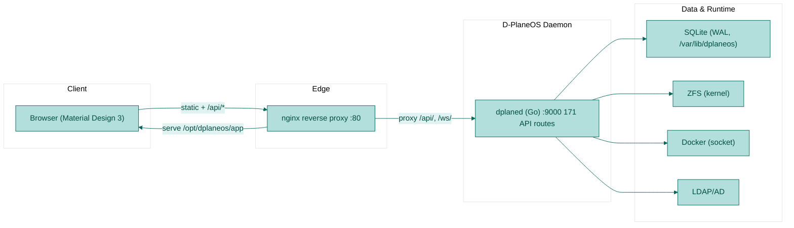
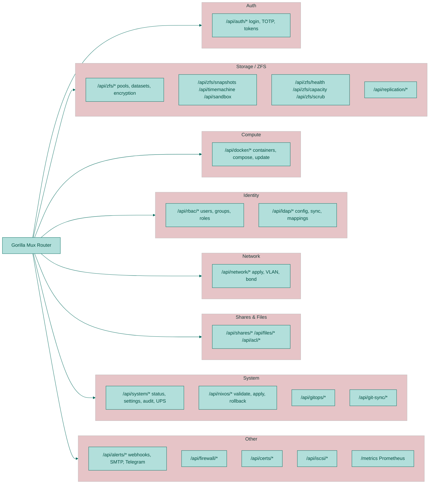
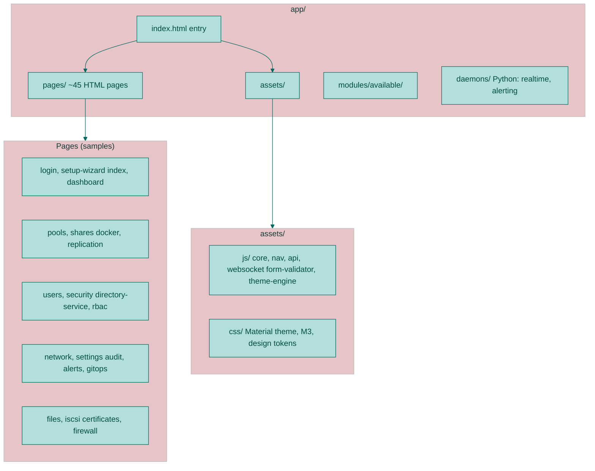
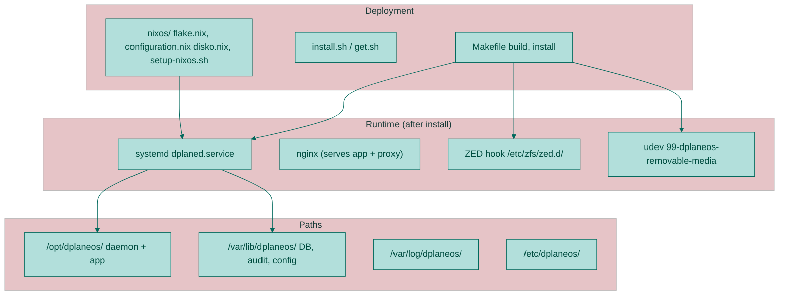
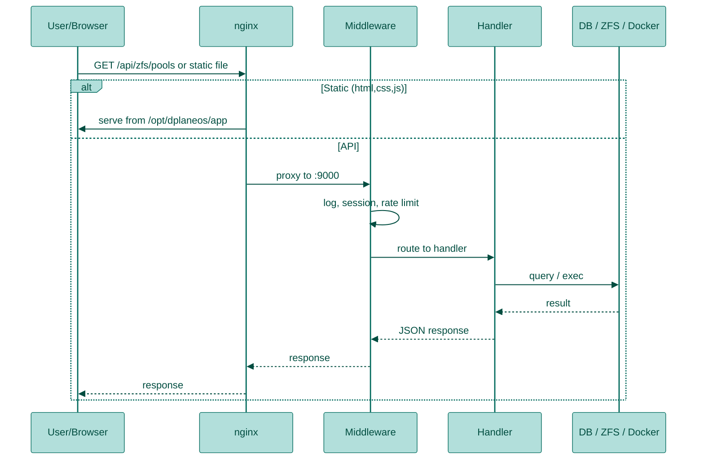

# D-PlaneOS Codebase — Architecture Diagrams

Visual overview of the D-PlaneOS v3.2.1 codebase. Render this file in any Mermaid-compatible viewer (e.g. GitHub, VS Code with Mermaid extension, or [mermaid.live](https://mermaid.live)).

---

**Mermaid version:**

---

## 1. Daemon Internal Structure (Go)

```mermaid
%%{init: {'theme':'base', 'themeVariables': { 'primaryColor':'#b2dfdb', 'primaryTextColor':'#004d40', 'primaryBorderColor':'#00695c', 'lineColor':'#00695c', 'secondaryColor':'#e0f2f1' }}}%%
flowchart TB
    subgraph cmd["cmd/dplaned"]
        main["main.go flags, DB init, router setup"]
        schema["schema.go SQLite schema"]
    end

    subgraph internal["internal/"]
        handlers["handlers/ ~50 handler files"]
        middleware["middleware/ logging, session, rate limit"]
        audit["audit/ logger, buffered, chain, HMAC"]
        security["security/ session, RBAC, whitelist"]
        ha["ha/ cluster manager"]
        zfs["zfs/ pool heartbeat"]
        dockerclient["dockerclient/"]
        ldap["ldap/"]
        gitops["gitops/ state, apply, drift, diff"]
        nixwriter["nixwriter/ NixOS fragment writer"]
        networkdwriter["networkdwriter/ systemd-networkd files"]
        reconciler["reconciler/ network state sync"]
        websocket["websocket/ monitor hub"]
        monitoring["monitoring/ background, inotify"]
        alerts["alerts/ Telegram"]
        hardware["hardware/ detection"]
        storage["storage/ mount guard"]
        indexing["indexing/ hybrid strategy"]
        cmdutil["cmdutil/ command whitelist"]
        netlinkx["netlinkx/"]
    end

    main --> handlers
    main --> middleware
    main --> audit
    main --> security
    main --> ha
    main --> zfs
    main --> dockerclient
    main --> ldap
    main --> gitops
    main --> nixwriter
    main --> networkdwriter
    main --> reconciler
    main --> websocket
    main --> monitoring
    main --> alerts
    handlers --> zfs
    handlers --> dockerclient
    handlers --> ldap
    handlers --> gitops
    handlers --> security
    handlers --> audit
```

---

## 2. API Domains (Handlers → Routes)

Handlers are grouped by API prefix; all go through **middleware** (logging, session, rate limit) and many use **RBAC** (`permRoute`).

---

## 3. Frontend (app/) Structure

---

## 4. Deployment & Runtime

---

## 5. Request Flow (Simplified)

---

## 6. Key Dependencies (Daemon)

| Layer      | Dependency / Component |
|-----------|--------------------------|
| HTTP      | gorilla/mux             |
| DB        | mattn/go-sqlite3 (CGO)  |
| Auth      | internal security + session |
| Config    | networkdwriter, nixwriter, reconciler |
| External  | ZFS CLI, Docker socket, LDAP, systemd-networkd |

---

*Generated for D-PlaneOS v3.2.1. Update this doc when adding major modules or routes.*
